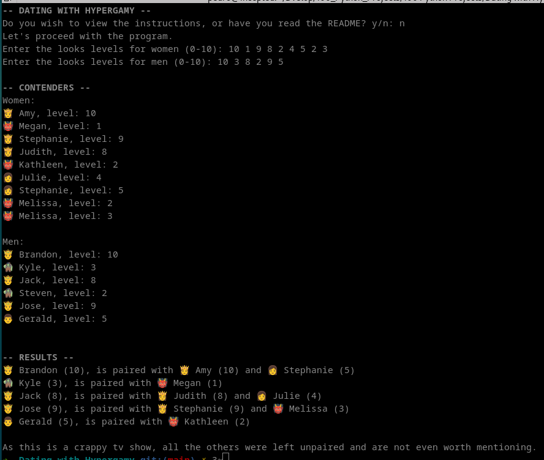

This exercise is based on this kata from codewars: https://www.codewars.com/kata/5f304fb8785c540016b9a97b/python 

## Codewars Kata: Dating with Hypergamy

### Description

A number of single men and women are locked together for a longer while in a villa or on an island, for the sake of a TV show. Because they spend quite some time together, all of them seek a partner to date. They are all shallow people, and they only care about looks, aka physical attractiveness when it comes to dating. Looks levels range from 1 to 10.

### Unwritten Rules for Their Choice of Partner

- Women never date men below their own looks level.
- Women are content with one partner, and when they have it, they don't look for a second man (yeah, I know, but let's assume this for this kata).
- Because women are hypergamous, they never settle for a man who's not at least 2 levels above their own, unless he's an 8 or above (but even then, the first rule applies).
- Men of level 8 or above (aka Chads) try to get 2 women, men below that are content with one.
- When women have a choice between two equally glamorous Chads, they prefer the one without a girlfriend.
- Both women and men try to get the best looking date(s) they can get.

These rules have nothing to do with reality, of course.

--------
LinkedIn: https://www.linkedin.com/in/pedrosmpm
